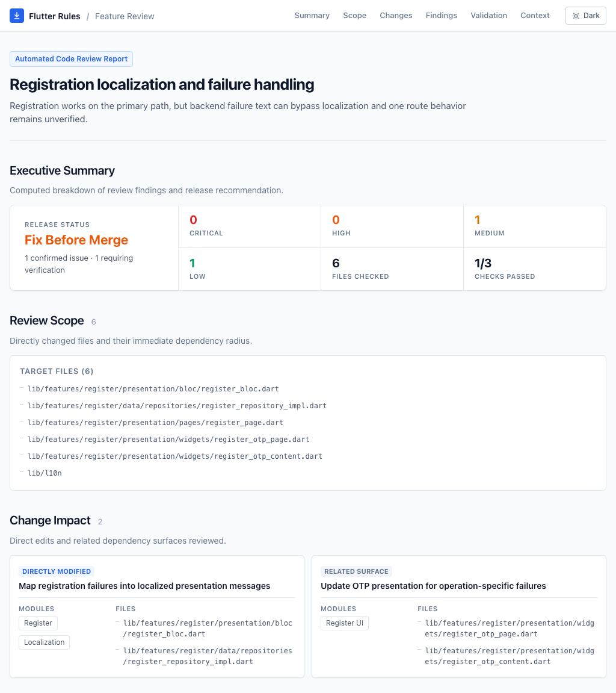
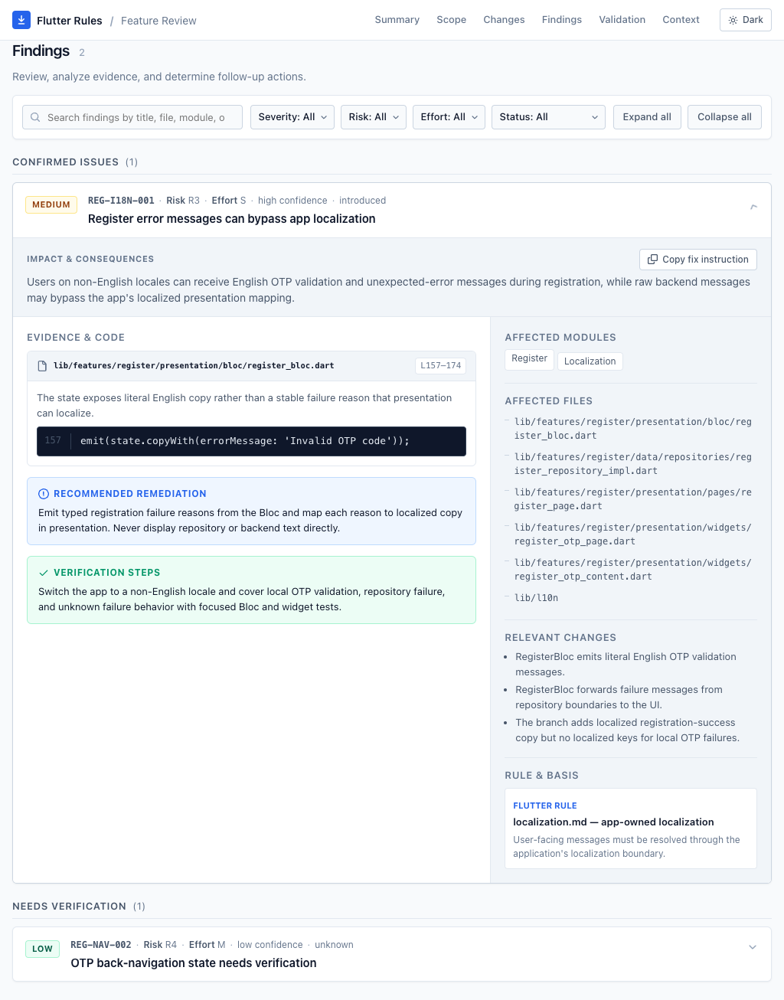
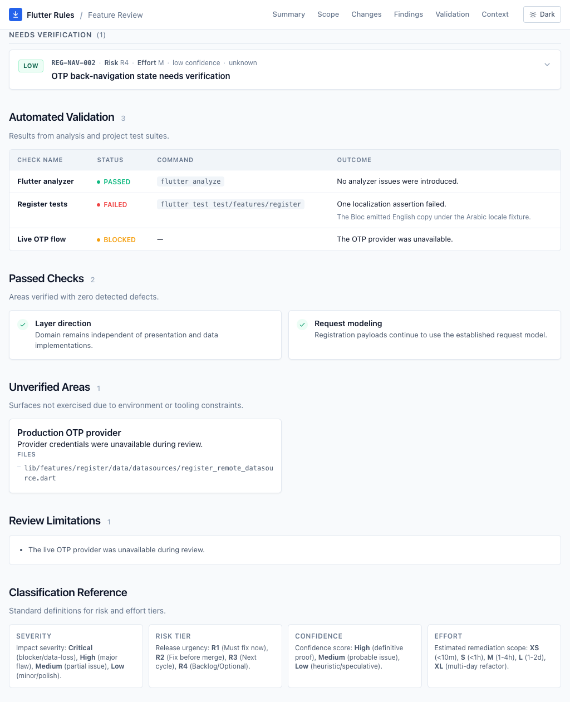

# Flutter Rules

[](https://github.com/aswinsubhash/flutter-rules/actions/workflows/validate.yml)
[](https://github.com/aswinsubhash/flutter-rules/tags)
[](https://www.npmjs.com/package/@aswinsubhash/flutter-rules)
[](https://agentskills.io/specification)

Reusable engineering guidance for building maintainable, production-ready
Flutter applications with AI coding agents.

Flutter Rules gives Codex, Claude Code, Cursor, and Devin a shared set of
principles for clean architecture, state management, UI, networking,
navigation, testing, and security. The skill applies only when you invoke it.

## What it covers

- Clean architecture and feature boundaries
- Effective Dart and Dart 3 language conventions
- Cubit/BLoC state management and testing conventions
- Flutter UI, accessibility, and responsive design
- Flutter layout-error diagnosis and debugging workflow
- API clients, models, repositories, and error handling
- Navigation and routing
- Testing, mirrored test placement, Bloc/Cubit policy validation, analysis,
  documentation, and code quality
- Secure storage and SharedPreferences usage
- Evidence-based implemented-feature review reports

## Install

Install Flutter Rules globally:

```bash
npx @aswinsubhash/flutter-rules@latest install
```

Claude Code is optional. Install its integration explicitly when needed:

```bash
npx @aswinsubhash/flutter-rules@latest install claude
```

Preview an installation without changing anything:

```bash
npx @aswinsubhash/flutter-rules@latest install --dry-run
```

Users upgrading from v1 can run the same install command. Verified legacy
Flutter Rules integrations are migrated automatically after the new install is
healthy.

## Use

| Agent | Invocation |
| --- | --- |
| Codex | `$flutter-rules` |
| Claude Code | `/flutter-rules` |
| Cursor | `/flutter-rules` |
| Devin | `@skills:flutter-rules` |

Examples for Codex:

```text
$flutter-rules review this authentication feature
$flutter-rules plan a new checkout flow
$flutter-rules check whether this session storage is secure
```

Start a new agent session after installation so the skill is discovered.

## Feature review reports

Every explicit request to review an implemented feature generates an offline,
display-only report. Flutter Rules determines the relevant diff, reviews the
changed and affected surfaces, and records:

- Critical, high, medium, and low findings
- Release risk tier, confidence, and remediation effort
- Affected modules, files, and relevant changes
- Exact evidence, impact, remediation, and verification guidance
- Validation results, passed checks, provenance for affected pre-existing findings,
  limitations, and unverified areas

Reports are stored in the reviewed project:

```text
.flutter-rules/reviews/<YYYYMMDDTHHMMSSZ>-<feature>/
  review.json
  review.html
```

`review.json` is the structured audit source and `review.html` is a searchable,
filterable view with all assets embedded. The skill attempts to open the HTML in
the default browser and prints its absolute path when automatic opening is not
available.

The review report is a human-in-the-loop workflow: the agent gathers evidence,
classifies findings, records validation limits, and presents the result for a
human release decision. Findings can be searched, filtered, expanded, deep-linked,
and copied as fix instructions to send back to the agent. The report is
display-only; it never changes application code automatically.

### Review report preview

The report is designed to make review scope, actionable findings, and verification
limits easy to scan:

<p align="center">
  
</p>

<p align="center">
  
</p>

<p align="center">
  
</p>

A feature review does not modify application code or implement its findings.
Choose the changes you want after reading the report, then give the agent that
follow-up scope. If the reports directory is not already ignored, the agent must
ask before adding it to `.gitignore`.

## Manage

Update every installed Flutter Rules integration:

```bash
npx @aswinsubhash/flutter-rules@latest update
```

Check installation health:

```bash
npx @aswinsubhash/flutter-rules@latest doctor
```

Get machine-readable health information:

```bash
npx @aswinsubhash/flutter-rules@latest doctor --json
```

Remove Flutter Rules and all managed integrations:

```bash
npx @aswinsubhash/flutter-rules@latest uninstall
```

Use `--help` to see all commands:

```bash
npx @aswinsubhash/flutter-rules@latest --help
```

## Community

- Read [CONTRIBUTING.md](CONTRIBUTING.md) to propose a rule or contribute a
  change.
- Use the issue forms to report a bug or propose a rule.
- Report vulnerabilities privately by following [SECURITY.md](SECURITY.md).
- Distributed under the [MIT License](LICENSE).

## Compatibility

- [Agent Skills specification](https://agentskills.io/specification)
- [Codex skills](https://developers.openai.com/codex/skills/)
- [Claude Code skills](https://code.claude.com/docs/en/slash-commands)
- [Cursor skills](https://cursor.com/docs/skills)
- [Devin skills](https://docs.devin.ai/product-guides/skills)
